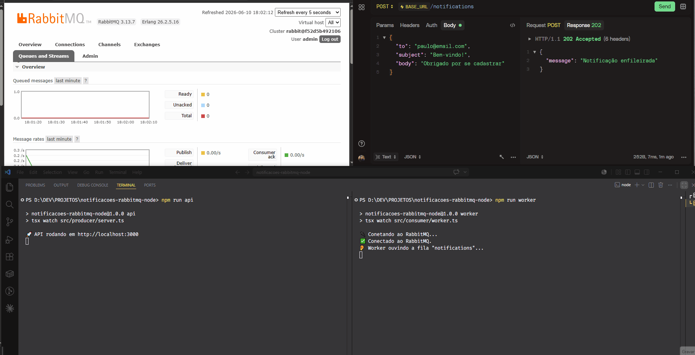

# 📬 API de Notificações com RabbitMQ + NestJS

Demonstração de **mensageria assíncrona** usando NestJS e
`@nestjs/microservices` com transporte RabbitMQ. Uma API REST publica eventos
de notificação, consumidos por um microservice em background.

> 💡 Implementei o mesmo projeto também com **Node.js puro** (`amqplib`) para
> comparar a abordagem "na mão" com a abstração do framework:
> https://github.com/paulomvrech/notifications-rabbitmq-node

## 🏗️ Arquitetura

```
Cliente → Controller (HTTP) → ClientProxy.emit → RabbitMQ → @EventPattern → "envia e-mail"
```

O controller HTTP apenas **emite um evento** para a fila e responde na hora
(`202 Accepted`). O microservice, decorado com `@EventPattern`, consome esse
evento em background. Producer e consumer são desacoplados — é o que o GIF
abaixo demonstra.

## 🎬 Demonstração



O que está acontecendo no GIF, passo a passo:

1. **Consumer ligado:** ao disparar uma requisição, o evento é publicado e
   processado pelo `@EventPattern` quase instantaneamente.
2. **Consumer desligado:** mesmo sem ninguém consumindo, a API HTTP continua
   aceitando requisições e respondendo na hora. As mensagens ficam **acumuladas
   e seguras na fila** `notifications` — o contador sobe no painel do RabbitMQ.
3. **Consumer religado:** ele imediatamente processa todas as mensagens
   represadas, e o contador da fila volta a zero.

Esse é o coração da mensageria assíncrona: **producer e consumer totalmente
desacoplados**. Se o consumer cair, nada se perde — o RabbitMQ guarda as
mensagens até alguém processá-las.

## 🛠️ Tecnologias
- NestJS + TypeScript
- `@nestjs/microservices` (`Transport.RMQ`)
- RabbitMQ
- Docker / Docker Compose

## 🚀 Como rodar

```bash
docker compose up -d      # sobe o RabbitMQ
npm install
npm run start:dev         # sobe HTTP + microservice
```

## 🧪 Testando

```bash
curl -X POST http://localhost:3000/notifications \
  -H "Content-Type: application/json" \
  -d '{"to":"teste@email.com","subject":"Olá","body":"Teste"}'
```

Painel de administração do RabbitMQ: http://localhost:15672 (admin / admin123)

> Dica: para reproduzir o experimento do GIF, comente a chamada
> `startAllMicroservices()` no `main.ts` (ou pare a aplicação), dispare alguns
> `curl` e observe as mensagens se acumularem na aba **Queues** do painel antes
> de religar.

## 📚 Conceitos demonstrados
- Producer (`ClientProxy`) e Consumer (`@EventPattern`) desacoplados
- Eventos (`emit`) vs Mensagens (`send`)
- `ack`/`nack` manual via `RmqContext`
- Filas duráveis e `prefetch`
- Reconexão automática (`amqp-connection-manager`)
